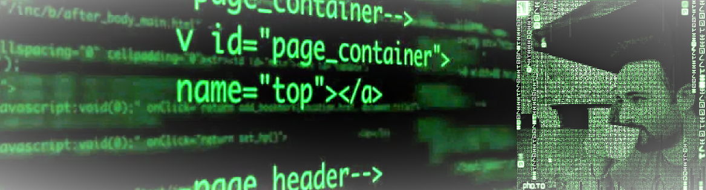

### Hi there 👋, my name is Amro
#### Writing the future one Repo at a time..

I work as a full-time Front-end engineer in Stuttgart-Germany, but can't help myself develop some full-stack / web-projects-architecture skills on the side :nerd_face:	 unless it is sunny outside. :sun_with_face:	

Since 2020 I've been living and breathing web-development:man_technologist:	, creating modern and user friendly interfaces makes my day. I've had the chance to immerse myself in different small freelance to enterprise-level-governmental projects in team-based scrum agile jira environemnts :woman_in_tuxedo::person_in_tuxedo:, aiming to make this world a little better place for users and developers alike through dry modular code. :abacus:	

- **:black_nib:	Tech stack:**

     Vue.js / REACT / JavaScript / TypeScript / Storybook / HTML / CSS / Sass / styledComponents / Tailwind / Next.js / Redux / Pimcore CMS / Typo3 CMS / Python   Fusion      360 3D Design

- **:telescope: Continuous Development:**

     As a life-long student my next career growth goals & signed up workshops focus on: PWAs, Node.js, Docker

